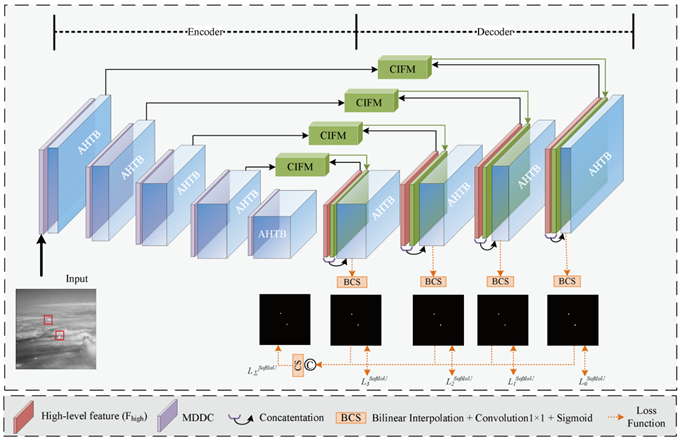

### 📖 Hybrid Attention and Adaptive Feature Fusion Network for Infrared Small Target Detection

<hr/>

# HAAF-Net
The Pytorch implementation of the our paper of HAAF-Net.



<hr/>

## Datasets Prepare

- NUAA-SIRST dataset is available at [NUAA-SIRST](https://github.com/YimianDai/sirst).
- NUDT-SIRST dataset is available at [NUDT-SIRST](https://github.com/YeRen123455/Infrared-Small-Target-Detection).
- IRSTD-1K dataset is available at [IRSTD-1K](https://github.com/RuiZhang97/ISNet).
- DenseSIRST dataset is available at [DenseSIRST](https://github.com/GrokCV/DenseSIRST).

<hr/>

## Usage
### Train

```python
python train.py configs/network/densesirst.py
```

### Test

```python
python test.py configs/network/densesirst.py logs/densesirst/best.pth.tar
```

<hr/>

